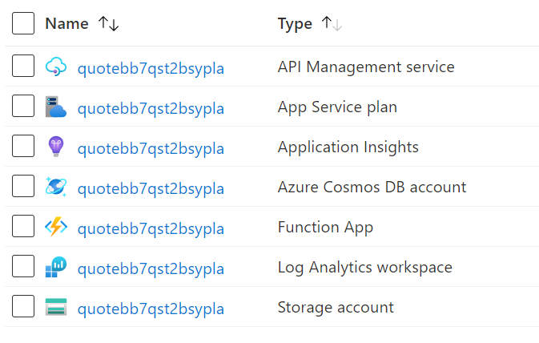
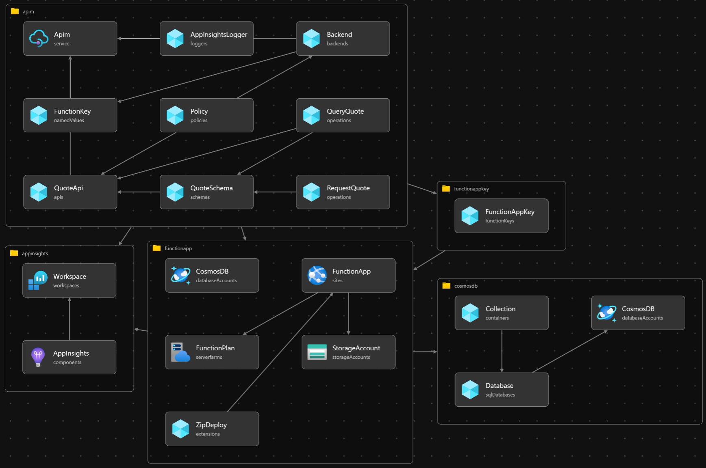

# Fan-Out Quote Demo

A quick demo of fan-out and fan-in using API-M, Functions, and Cosmos DB

## Walkthrough

- Using API-M (either directly, via Postman, or within a Power App) you can request a new quote by POSTing to the "Request Quote" API. This will return a quote ID (take note of this for later)
- API-M will call the Azure Function, which is responsible for creating the quote request, and passing it to the quote processor. Think [CQRS](https://docs.microsoft.com/en-us/azure/architecture/patterns/cqrs) style.
  - In this demo the quote processor is in the same Function App as the API, these can be separated out
  - _TODO: At the moment all queueing is just using storage queues, this could be swapped for Service Bus_
- The quote processor will then hand off to each of the quote "providers". In this demo the providers are simulated using visibility timeouts within a queue to emulate processing time, there is no guarantee that a provider will come back within the time-window.
  - _TODO: Add random chance for a provider to drop a request and never respond_
- When a response is received by the quote processor, it drops it into Cosmos DB. The Request ID is used as the partition key to enable easy querying. There is a 5-minute TTL on documents, so old quotes will automatically be cleaned up.
- At any time during the process above, you can use the "Query Quote" endpoint to check on provider responses. Querying a non-existent ID should result in an error.
  - If you are building a Power App using this API, consider using a timer to wait until a few results are returned before navigating to the next page, the status can be updated by continuously querying the "Query Quote" endpoint.

## Resources

## Bicep Deployment

